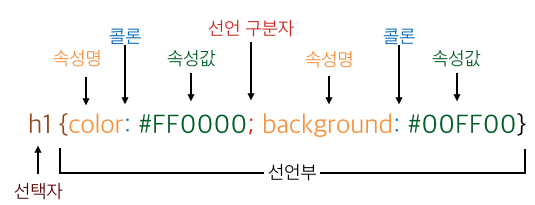

# CSS

## CSS 문법



## 1. 선택자 selectors

> CSS 우선순위  
> 태그 스타일 -> class 스타일 -> id 스타일 -> 인라인 스타일 -> !important

- 전체 선택자 <font color='dodgerblue' size='5px'>**\***</font>

  > HTML 문서 내부의 모든 요소 선택

  ```css
  <style>
     * { color: red; }
  </style>
  ```

- HTML 요소 선택자 <font color='dodgerblue' size='4px'>**h1, h2, div...**</font>

  > HTML 요소의 이름을 사용하여 선택

  ```css
  <style>
     h2 { color: teal; }
  </style>
  ```

- 아이디(id) 선택자 <font color='dodgerblue' size='5px'>**#**</font>

  > 특정 아이디 이름을 가지는 요소만을 선택

  ```css
  <style>
     #heading { color: sandybrown; }
  </style>
  ...
  <h2 id="heading">이 부분에 스타일을 적용합니다.</h2>
  ```

- 클래스(class) 선택자 <font color='dodgerblue' size='20px'>**.**</font>

  > 특정 아이디 이름을 가지는 요소만을 선택

  ```css
  <style>
     #heading { color: sandybrown; }
  </style>
  ...
  <h2 id="heading">이 부분에 스타일을 적용합니다.</h2>
  ```

- 반응(state) 선택자 <font color='dodgerblue' size='5px'>**:**</font>

  > 사용자의 움직임에 따라 선택

  ```css
  <style>
     :hover { color: sandybrown; }
  </style>
  ```

- 속성(attribute) 선택자 <font color='dodgerblue' size='5px'>**[]**</font>

  > 특정 속성이나 속성값을 가지고 있는 HTML요소 선택

  ```css
  <style>
     [title] { background: black; color: yellow; }
  </style>
  ```

  title 속성을 가지는 요소 선택

  ```css
  <style>
     [title="first h2"] { background: black; color: yellow; }
  </style>
  ```

  tilte 속성이 first h2인 요소 선택

  > 여러 속성 선택자

  | 선택자                      | 설명                                                                   |
  | --------------------------- | ---------------------------------------------------------------------- |
  | [속성이름^="속성값"] 선택자 | 특정 속성의 속성값이 특정 문자열로 시작하는 요소 선택                  |
  | [속성이름$="속성값"] 선택자 | 특정 속성의 속성값이 특정 문자열로 끝나는 요소 선택                    |
  | [속성이름*="속성값"] 선택자 | 특정 속성의 속성값이 특정 문자열로 시작하는 하나의 단어로 된 요소 선택 |

- 그 외 여러 선택자

  | 선택자            | 설명                                                                                          |
  | ----------------- | --------------------------------------------------------------------------------------------- |
  | :nth-child        | 모든 자식(child) 요소들 중에서 앞에서부터 n번째에 위치한 자식(child) 요소를 모두 선택함.      |
  | :nth-last-child   | 모든 자식(child) 요소들 중에서 뒤에서부터 n번째에 위치한 자식(child) 요소를 모두 선택함.      |
  | :nth-of-type      | 모든 자식(child) 요소들 중에서 n번째로 등장하는 특정 타입의 요소를 모두 선택함.               |
  | :nth-last-of-type | 모든 자식(child) 요소들 중에서 뒤에서부터 n번째로 등장하는 특정 타입의 요소를 모두 선택함.    |
  | :last-child       | 모든 자식(child) 요소들 중에서 맨 마지막에 위치한 자식(child) 요소를 모두 선택함.             |
  | :first-of-type    | 모든 자식(child) 요소들 중에서 맨 처음으로 등장하는 특정 타입의 요소를 모두 선택함.           |
  | :last-of-type     | 모든 자식(child) 요소들 중에서 맨 마지막으로 등장하는 특정 타입의 요소를 모두 선택함.         |
  | :only-child       | 자식(child) 요소를 단 하나만 가지는 모든 요소의 자식(child) 요소를 선택함.                    |
  | :only-of-type     | 자식(child) 요소로 특정 타입의 요소를 단 하나만 가지는 모든 요소의 자식(child) 요소를 선택함. |
  | :empty            | 자식(child) 요소를 전혀 가지고 있지 않은 요소를 모두 선택함.                                  |
  | :target           | 현재 활성화된 target 요소를 모두 선택함.                                                      |
  | :checked          | 체크된(checked) 상태의 input 요소를 모두 선택함.                                              |
  | :enabled          | 사용할 수 있는 input 요소를 모두 선택함.                                                      |
  | :disabled         | 사용할 수 없는 input 요소를 모두 선택함.                                                      |
  | :not(선택자)      | 모든 선택자와 함께 사용할 수 있으며, 해당 선택자의 의미를 반대로 적용함.                      |
