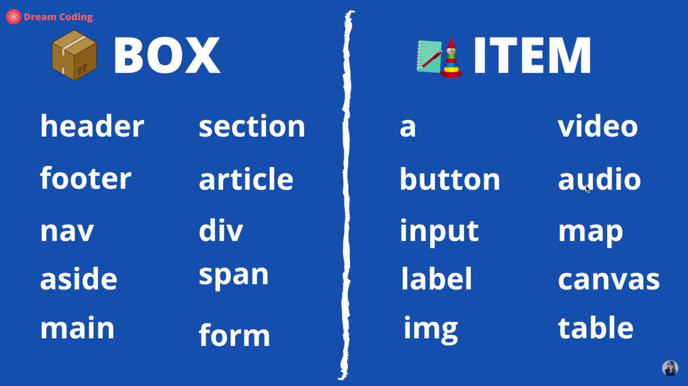
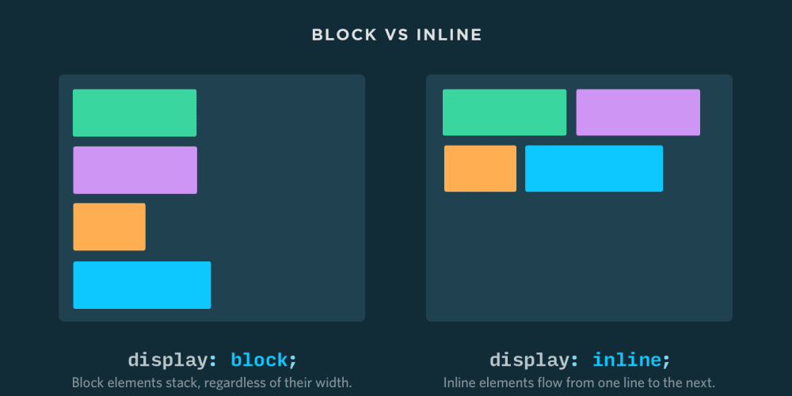
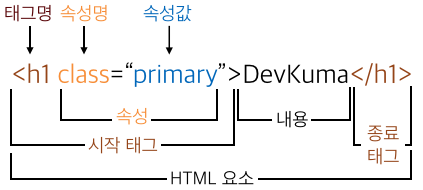
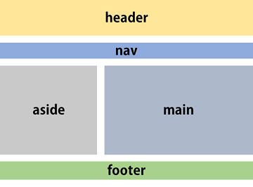

# HTML

## 1. tag



> HTML 태그는 크게 BOX와 ITEM으로 나눌 수 있다.  
> **BOX** : 사용자에게 보여지지 않음, **ITEM** : 사용자에게 보여짐

## 2. Block vs Inline



> ITEM은 Block과 Inline으로 나눌 수 있다.  
> **Block**은 한줄을 차지하고, **Inline**은 한줄에 다른 ITEM들과 나란히 배치

## 3. HTML Element



```html
 <태그명 속성명="속성값">내용</태그명>
```

### 요소(Element)

- HTML에서 시작 태그와 종료 태그로 이루어진 명령어

### 태그(Tag)

- 요소의 일부로 시작태그와 종료 태그 두 종류

### 속성(Attribute)

1.  요소의 시작 태그 안에서 사용되는 것으로 구체화된 명령어 체계, 속성이름과 속성값으로 표현
1.  속성명은 소문자로 작성
1.  속성값은 따옴표로 감싸기. (ex. class='class')

## 4. HTML layout



| 의미 요소   | 설명                                                         |
| ----------- | ------------------------------------------------------------ |
| `<header>`  | HTML 문서나 섹션(section) 부분에 대한 헤더(header)를 정의함. |
| `<nav>`     | HTML 문서의 탐색 링크를 정의함.                              |
| `<main>`    | HTML 문서의 주요 콘텐츠(content)를 정의함.                   |
| `<article>` | HTML 문서에서 섹션(section) 부분을 정의함.                   |
| `<aside>`   | HTML 문서에서 독립적인 하나의 글(article) 부분을 정의함.     |
| `<footer>`  | HTML 문서에서 페이지 부분 이외의 콘텐츠(content)를 정의함.   |
