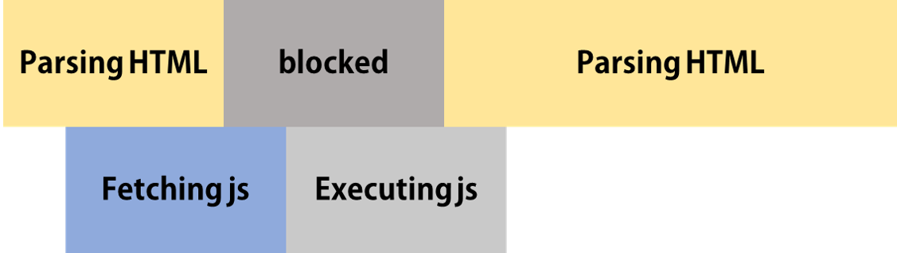
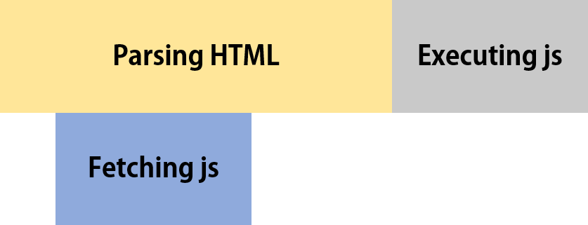

# Java Script

## 1. 스크립트 html연동
> async와 defer 차이점
### async
```jsx
<head>
  <script asyn src="main.js"></script>
</head>
```

html 파싱하는 동안 병렬로 js파일 다운로드한다.  
js 파일이 다운로드 되면 파싱을 멈추고 js 파일 실행


> async 문제점
1. html 파싱동안 js파일 실행되면 멈춤
2. 다수의 스크립트 다운 → 다운로드 먼저 완료된 순서대로 스크립트 실행 됨


### defer
```jsx
<head>
  <script defer src="main.js"></script>
</head>
```
html 파싱하는동안 js 파일을 받고 파싱이 끝나면 순서대로 실행


### strict
```jsx
'use strict';
```

비상식적인 코드 쓸수 없다.(ex. 선언되지 않은 변수 사용)  
비상식적인 코드 쓸수 없다.(ex. 선언되지 않은 변수 사용)  
효율적 분석가능 → 성능개선
