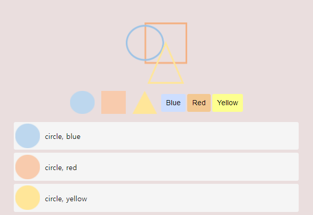

# Java Script(with HTML, CSS)

[간단한 웹 어플리케이션(도형 선택기)](https://github.com/hasunghwa/shapeSelector/tree/master)



## 프로젝트를 통해 배운 점

### 1\. CSS

- 변수  
  CSS에서는 변수를 다음과 같이 선언하고 사용한다
  ```css
  :root {
    /* --variable-name: value; */
    --color-yellow: #fdff8f;
    --annimation-duration: 300ms;
    --margin-space: 4px;
  }
  div {
    property: var(--variable-name);
  }
  ```
- calc()  
  calc를 활용하여 CSS의 속성의 값으로 계산식을 지정할 수 있다
  ```css
  /* property: calc(expression) */
  margin-bottom: calc(var(--margin-space) * 4);
  ```
- transition transform  
  transition은 마우스를 클릭하거나 hover 상태에 변화를 주고  
  transform은 회전, 확대/축소, 위치변경과 같은 변경 처리  
  버튼이 hover면 크기를 300ms만에 1.2배 확대하는 css코드이다.

  ```css
  .btn{
    transition: transform: 300ms ease;
  }

  .btn:hover,
  .logo:hover {
    transform: scale(1.2);
  }
  ```

### 2\. JavaScript

- fetch  
  fetch를 통해 api를 호출하거나, 데이터를 다운받을 수 있다.  
  호출이 성공하면 response객체를 반환한다.
  ```jsx
  function loadItems() {
    return fetch("data/data.json")
      .then((response) => response.json())
      .then((json) => json.items);
  }
  ```
- querySelector, innerHTML  
  querySelector를 통해 html의 요소를 등록할 수 있다.  
  등록한 html요소의 내부 html을 innerHTML을 통해 변경할 수 있다.
  ```jsx
  function displayItems(items) {
    const container = document.querySelector(".items");
    container.innerHTML = items.map((item) => createHTMLString(item)).join("");
  }
  ```
- addEventListener, event  
  addEventListener를 통해 버튼에 클릭이벤트 등록  
  넘어온 event의 key와 value를 통해 해당하는 아이템 출력
  ```jsx
  buttons.addEventListener("click", (event) => onButtonClick(event, items));
  function onButtonClick(event, items) {
    const dataset = event.target.dataset;
    const key = dataset.key;
    const value = dataset.value;
    displayItems(items.filter((item) => item[key] == value));
  }
  ```

### 3\. HTML

- data- 속성  
  요소에 특정한 데이터를 저장하고 싶은 경우 자유롭게 사용할 수 있다.
  ```html
  <button class="btn colorbtn blue" data-key="color" data-value="blue">
    Blue
  </button>
  ```
