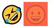

# REACT

## styled-components

> ● Javascripte파일 내에서 CSS를 사용할 수 있게 해주는 라이브러리  
> ● Javascript코드 내에서 CSS스타일 지정

> 장점: class선언 없이 component에 CSS를 입힐 수 있어 class명의 중복을 막을 수 있다.

## 1. 설치 방법

```cmd
npm install styled-components
```

설치후 js파일에 import

```jsx
import styled from "styled-components;";
```

## 2. 사용방법

> ● styled.div(생성하고 싶은 태그)로 생성  
> ● styled.태그 뒤 백틱(``)안에 원하는 css스타일 작성

```jsx
let tagname = styled.div`
  padding: 20px;
  background-color: red;
`;
```

### props 사용

> props를 통해 속성값을 인자로 넘겨받을 수 있다.

```jsx
let Box = styled.div`
  width: 50px;
  height: 50px;
  background-color: ${(props) => props.bgColor};
`;

<Box bgColor="red" />;
<Box bgColor="blue" />;
```

### override

> 부모로부터 요소를 물려받을 수도 있다.  
> Box요소를 가져와 Circle생성

```jsx
const Circle = styled(Box)`
  border-radius: 50px;
`;
// 위 코드와 동일한 코드
const Circle = styled.div`
  width: 50px;
  height: 50px;
  background-color: ${(props) => props.bgColor};
  border-radius: 50px;
`;

<Circle bgColor="yellow" />;
```

### as

> as를 사용하여 styled tag를 변경할 수 있다.

```jsx
const Btn = styled.button`
  color: white;
  background-color: tomato;
  border: 0;
  border-radius: 15px;
`;

<Btn as="a" href="/" />;
```

button tag로 생성한 component를 as를 사용하여 a태그로 변경

### attributes (attrs)

> attrs를 통해 component의 속성값에 접근할 수 있다.

```jsx
const Input = styled.input.attrs({ required: true })`
  background-color: tomato;
`;
```

### animation & keyframes

> animation 또한 Javascripte코드 내에서 사용할 수 있다.

```jsx
import { keyframes } from "styled-components";
const rotation = keyframes`
  from {
    transform:rotate(0deg);
  }
  to {
    transform:rotate(360deg);
  }
`;

const Box = styled.div`
  height: 50px;
  width: 50px;
  background-color: tomato;
  animation: ${rotation} 1s linear infinite;
`;
```

keyframses를 통해 애니메이션을 설정하고,
animation인자로 애니메이션을 등록하고 생성한다.
[animation 추가설명](https://github.com/hasunghwa/TIL/blob/main/HTML_CSS/220107_CSS_animation.md)

### 자식요소 && pseudo selector

> styled를 사용하면 component의 자식요소 CSS에도 접근이 가능하다.  
>  아래코드는 Box component에서 Emoji component를 접근하여 CSS를 변경한 코드이다.

```jsx
const Emoji = styled.span`
  font-size: 36px;
`;

const Box = styled.div`
  height: 50px;
  width: 50px;
  background-color: tomato;
  ${Emoji}{
    opacity: 0.2;
    &:hover {
      font-size: 72px;
    }
  }
`
<Emoji>🤣</Emoji>
<Box>
  <Emoji>😀</Emoji>
</Box>;
```

그림에서 볼 수 있듯이 Box안에 있는 Emoji에만 opacity속성이 추가된 것을 확인할 수 있다.

  
의사 클래스또한 사용 가능하다.(hover)  

